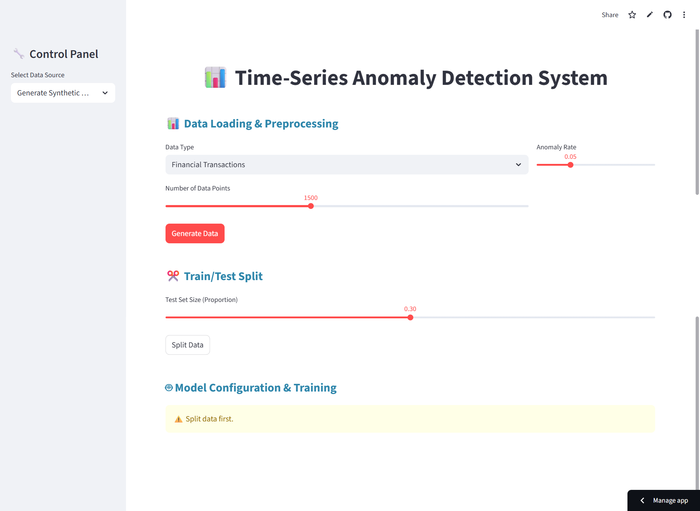

[](./LICENSE)


---

# 📊 Time-Series Anomaly Detection System  
### _An Interactive, Explainable, and Research-Ready Dashboard for Detecting Anomalies in Time-Series Data_

---

## 🧠 Overview  
This project is a **Streamlit-based AI system** designed to **detect anomalies in time-series datasets** using **Prophet (forecasting)** and **Isolation Forest (machine learning)**.  

It provides a **no-code web dashboard** where users can:  
- Upload or generate datasets  
- Train and compare models  
- Visualize anomalies interactively  
- Export performance reports  

Built for **researchers, students, and engineers** exploring anomaly detection in **finance, IoT, and system monitoring**.  

---

## ✨ Key Features  
✅ Streamlit-based interactive dashboard  
✅ Multiple models – Prophet + Isolation Forest  
✅ Synthetic data generator (IoT, financial, system)  
✅ Adjustable train/test split  
✅ Real-time Plotly visualizations  
✅ Evaluation metrics dashboard (Accuracy, F1, ROC-AUC)  
✅ Model profiling (time, memory, precision)  
✅ Export results to CSV  
✅ Modular, research-ready code  

---

## 🧩 Tech Stack  
| Category | Technology |
|-----------|-------------|
| **Frontend / UI** | Streamlit |
| **ML Models** | Scikit-learn, Prophet |
| **Data Handling** | Pandas, NumPy |
| **Visualization** | Plotly |
| **Language** | Python 3.10+ |

---

## 🚀 Getting Started  

### 1️⃣ Clone the Repository  
```bash
git clone https://github.com/dheerajkumar47/Time-Series-Anomaly-Detection.git
cd Time-Series-Anomaly-Detection
```
2️⃣ Create Virtual Environment
```

python -m venv .venv
# Activate (Windows)

.venv\Scripts\activate
# Activate (Mac/Linux)

source .venv/bin/activate
```
3️⃣ Install Dependencies
```
pip install -r requirements.txt
```
4️⃣ Run the Application
```
streamlit run app.py
```
Once executed, the dashboard automatically opens in your browser. 🎉```
## Roadmap
```
├── app.py                  # Main Streamlit app (UI + logic)
├── data_generator.py       # Synthetic data creation
├── anomaly_detectors.py    # Prophet & Isolation Forest models
├── utils.py                # Helper functions (plots, preprocessing)
├── requirements.txt        # Dependencies
├── LICENSE                 # MIT License
└── README.md               # Documentation

```
## Documentation

🧮 Core Models

🔹 Prophet
```
Developed by Meta (Facebook).
Detects anomalies based on deviations from trend-seasonality forecasts.
Best suited for time-dependent structured data like finance, weather, and IoT.
```
🔹 Isolation Forest
```
Tree-based unsupervised algorithm that isolates anomalies.
Great for detecting irregular patterns in high-dimensional data.


## Screenshots

![App Screenshot]

💡 Make sure your images are stored in a folder named images at the root of your repo.

---

🧪 Evaluation Metrics
Automatically computed:

Accuracy
Precision
Recall
F1 Score
ROC-AUC
Execution Time
Memory Usage

---

🌍 Real-World Applications
✅ Finance – Fraud or irregular transaction detection
✅ IoT Systems – Sensor drift and device malfunction alerts
✅ Cybersecurity – Network traffic anomaly detection
✅ Healthcare – Abnormal pattern detection in vitals
✅ Industry 4.0 – Predictive maintenance monitoring

---

🔮 Future Scope
🚧 Planned Enhancements:

---

Integration with LSTM-based deep learning models
AutoML support for model selection
Real-time streaming anomaly detection
Cloud integration (AWS / GCP dashboards)
PDF export for research reports

---

🤝 Contributing
Contributions are welcome!

Open issues for bugs or suggestions
Fork and submit pull requests

---

🏅 Author & Attribution
Developed by Dheeraj Kumar
📍 B.S. Software Engineering, Iqra University (Class of 2025)
🎓 Focus Areas: AI • Machine Learning • Data Analysis • Research Systems

If you use this project, please credit by linking back to this repository.
Licensed under the MIT License.

---

💬 About the Developer
Hi, I’m Dheeraj Kumar — passionate about AI, ML, and data-driven software.
This project combines my love for research and development, making AI more accessible and visual.

---

📫 Contact:

LinkedIn
https://www.linkedin.com/in/dheeraj-kumar-b21a741a2/
GitHub
📧 dheerajkumar47@gmail.com

---

🙏 Acknowledgements
Special thanks to the open-source communities behind:

Streamlit
Prophet
Scikit-learn
Plotly

⭐ If you like this project, please give it a star on GitHub — it helps support future open-source research!

---
